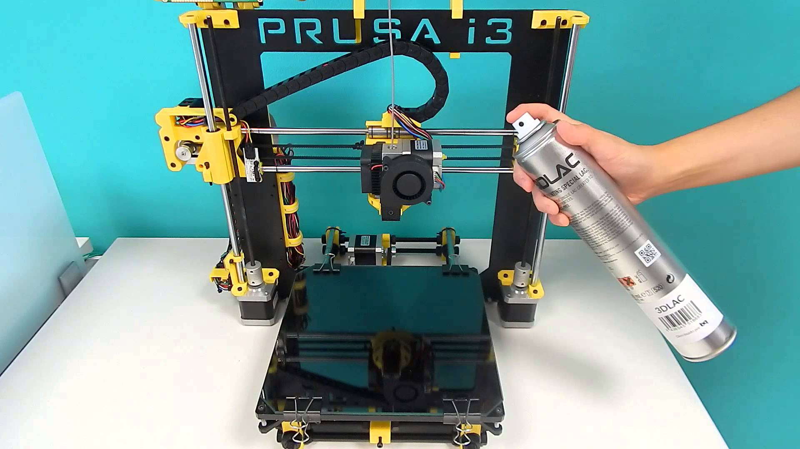
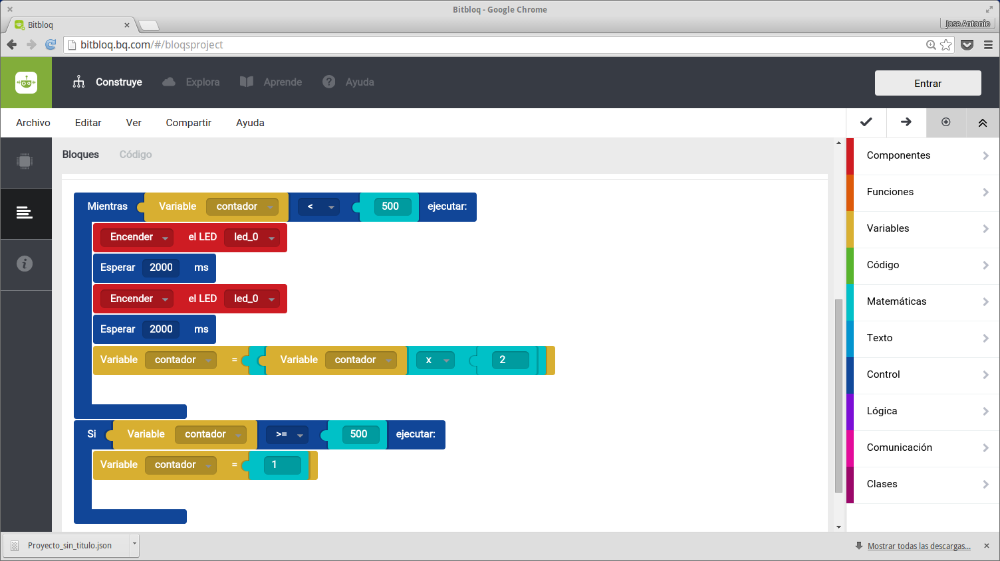
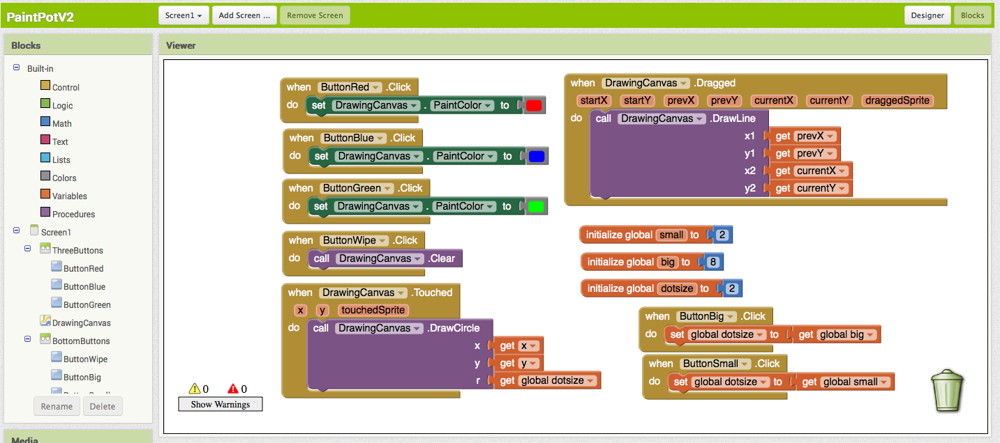

# ¿Por qué enseñar robótica hoy en día?

## Granabot 2016

### José Antonio Vacas @javacasm

## La moda de la robótica

* MOOCs Robóticos
* Experiencias online everywhere

## ¿Proyectos de robótica o mejor proyectos que usan robótica?

* ¿Asignatura de robótica?

* ¿Enseñar robótica?

* ¿qué aporta?

### Mejor si lo usamos como algo transversal

### ¿Edades?

* ¿Uno para todos o uno para cada edad?

## ¿Coste?

* Podemos aprender a reciclar materiales

## ¿Qué es la robótica?

* ¿Seré capaz de programar? Vamos a verlo...
	* ¿Podemos enseñar a programar?
	* ¿Para qué sirve programar?

* ¿Seré capaz de diseñar en 3D? Veámoslo
	* ¿Lo uso o lo hago?

* ¿Sabré electrónica? Kits

* ¿Sabré dirigirlos? ¡Seguro que sí!
	* Trabajando los proyectos

* ¿Necesito un taller?
	* Trabajando fuera del aula

## [OpenSource](./OpenSource.md)

## [Herramientas](./herramientas.md)

## Ejemplos

No todos los robots lo parecen

* Invernaderos automáticos = Biología + meteorología + Ecología

* Robots que al moverse hacen matemáticas: matemáticas para hacer que un robot se mueva

* ¿Puedo enseñar historia con Scratch?
# ¿Por qué enseñar robótica hoy en día?

## Granabot 2016

### José Antonio Vacas @javacasm

# Open Source

## Movimiento Open Source

## Licencias

#### ¿Qué significa CC?
#####  Licencias
#####  ¿por qué?
#####  ¿Compartir?

### ¿Por qué me gusta esta forma de funcionar?

#### Porque puedo hacer las cosas por mi mismo, cuando las entiendo, las puedo modificar y adaptarlas

### Ejemplo: [Arduino](http://www.arduino.cc)

### Ejemplo: impresoras 3D
Imágenes, diseños, electrónica, programas

[¿Por qué usar Open Source en educación?](http://www.slideshare.net/josepujolperez/programacion-y-robtica-secundaria-open-source?next_slideshow=1)

[Más sobre el tema](https://github.com/javacasm/ILoveOpen/blob/master/contenidos.md)

## Recursos libres

### [Coursera](https://es.coursera.org/)

### [edx](https://www.edx.org/)

### [udacity](https://www.udacity.com/me#!/)

### [miriadax](https://miriadax.net/home)
# ¿Por qué enseñar robótica hoy en día?

## Granabot 2016

### José Antonio Vacas @javacasm

# Herramientas

## [Arduino](https://github.com/javacasm/ProgramarParaEducar/blob/master/Arduino.md)

[Bitbloq](https://github.com/javacasm/ProgramarParaEducar/blob/master/BitBloq.md)

## Impresión 3D

## [Scratch](https://github.com/javacasm/ProgramarParaEducar/blob/master/Scratch.md)

## [AppInventor](https://github.com/javacasm/ProgramarParaEducar/blob/master/AppInventor.md)

## [Proyectos](https://github.com/javacasm/ProgramarParaEducar/blob/master/Proyectos.md)

[SkyBot](http://www.iearobotics.com/wiki/index.php?title=Mini-Skybot)

